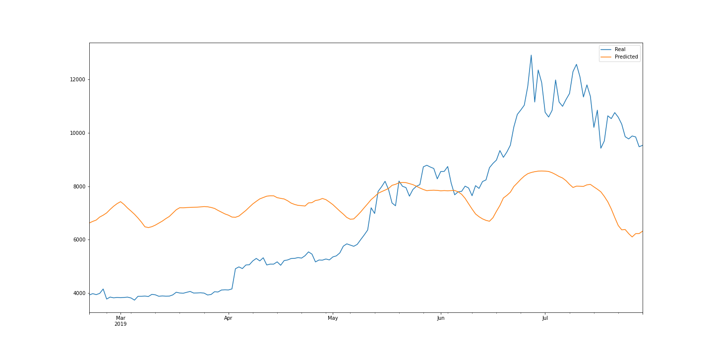

# Unit-14_LSTM-Stock-Predictor

### Objective of this Assignment
To use deep learning models to determine if the FNG indicator provides a better signal for cryptocurrencies than the normal closing price data. Specifically for Bitcoin (BTC)

### Defining our models

**Model 1**
	* LSTM RNN Closing Prices

**Model 2**
	* LSTM RNN FNG

### Which model has a lower loss?

Model 1 (LSTM RNN Closing Prices) has the lower loss at each of the different window sizes tried. Of note is when the batch size was 1, Model 1 had minimised loss to 0.05 vs Model 2 (LSTM RNN FNG) whose loss was 0.11 (two times higher!).

**At Window 10, Batch size = 10**
	* Model 1: loss 0.0128
	* Model 2: loss 0.0658

**At Window 10, Batch size = 1**
	* Model 1: loss 0.0502
	* Model 2: loss 0.1183

**At Window 5, Batch size = 10**
	* Model 1: loss 0.0423
	* Model 2: loss 0.0823

**At Window 1, Batch size = 10**
	* Model 1: loss 0.0895
	* Model 2: loss 0.0890

### Which model tracks the actual values better over time?

**At Window 10, Batch size = 10**
	* 
	
	

**At Window 10, Batch size = 1**
	* 
	
	

**At Window 5, Batch size = 10**
	* 
	
	

**At Window 1, Batch size = 10**
	* 
	
	

### Which window size works best for the model?

With a batch size kept consistent at 10, a window size of 10 worked better for each model as evident by the plots above.

### Conclusion
Model 1 which used closing price data provided a better model for predicting the price of Bitcoin than the FNG index.

